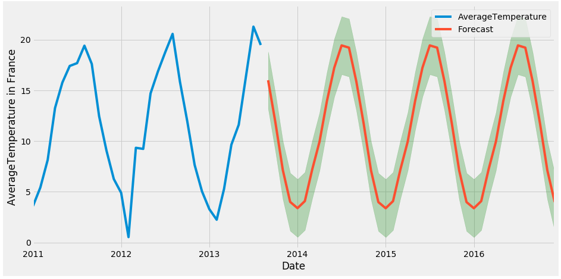

# Time_Series_Project
The objective of this project is to forecast temperature change in France, based on GlobalTemperatureChange time series data https://www.kaggle.com/berkeleyearth/climate-change-earth-surface-temperature-data imported from the Kaggle website. The project goes through the different steps of a data science project, from data collection and analysis using different tools and techs like Python, Pandas, MatplotLib and Seaborn to model building using the python frameworks StatsModels.

The image belwo present the final result obtained afted building the model:

